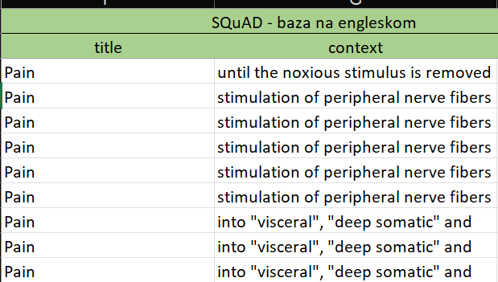

# 📊 Text Analysis App

Ovaj projekat je deo ispitnog zadatka na predmetu Programiranje za lingviste na masterskom programu 
Računarstvo u društvenim naukama na Univerzitetu u Beogradu. 

📊 Text Analysis App: CLI aplikacija koja iz .xlsx fajlova određene* strukture: 
1) ekstrahuje tekstove 
2) dodeljuje im odgovarajuće naslove
3) vrši analizu tih tekstova (na engleskom jeziku) korištenjem **SpaCy** biblioteke 

Rezultat analize su tri fajla koja sadrže: 

📌 .json: 
- ✅ broj tokena u svakom tekstu po temi
- ✅ listu tokena u okviru svake teme
- ✅ TTR za svaki tekst

📌 .json:
- ✅  liste imenovanih entita razvrstane po njihovim tipovima za svaki tekst

📌 .xlsx:
- ✅ Matricu vektorske sličnosti tekstova sa izdvojenim parovima tekstova sa graničnim vrednostima (najvećom i najmanjom) 

*Preview izgled output fajlova se može naći u folderu ** images** . 

---

## ⚡ Instalacija i pokretanje aplikacije

```bash
# Kloniranje repozitorijuma  
git clone https://github.com/sara-barac/text-analysis-app.git
cd text-analysis-app
``` 
Kreiranje virtuelnog okrženja
```bash
python -m venv .venv
```

Aktivacija okruženja

| OS / Shell                       | Komanda za aktivaciju                |
|----------------------------------|---------------------------------------|
| Windows Bash (VS Code, Git Bash) | ```bash source .venv/Scripts/activate``` |
| Windows PowerShell               | ```bash .venv\Scripts\Activate.ps1```    |
| Windows CMD                      | ```bash .venv\Scripts\activate.bat```    |
| Linux / macOS Bash               | ```bash source .venv/bin/activate```     |


Instalacija svih komponenti aplikacije
```bash
pip install -e .
```

Pokretanje aplikacije 
```bash
textan 
```


------------------------------------------------------------------------------

relevantni deo izgleda .xlsx fajlova u kome je sadržan tekst



